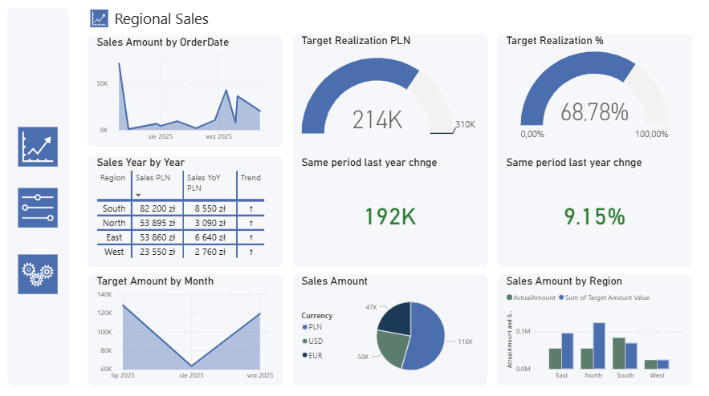

# 📊 Power BI Report – Sample Dashboards
This repository contains sample Power BI visualizations and SQL scripts based on fictional data.
---

## 🪑 Report for a Furniture Manufacturer
- **Sales Overview**  
  Sales trends across four regions for a furniture manufacturer.  
  

- **Customers Orders**  
  Overview of customer order volumes and shipment delays, highlighting fulfillment gaps.  
  

- **Sales Target**  
  Dashboard presenting sales targets to support strategic decision-making.  
  
---

## 🚚 Report for Logistic
- **Logistic – Orders & Stock**  
  Summary of stock levels and order volumes across logistic channels.  
  

- **Profitability Overview – Key Matrix & Flow**  
  Visualization of profitability metrics and financial flow.
  
---

## 📍 Regional Sales & Quarterly Target Report
Comparison of actual sales vs. planned targets for Q3, with KPI indicators.

---

## 🧠 Data Model Preparation in Power BI
To optimize report performance and simplify data relationships, a dedicated data model was prepared in Power BI.  
The original snowflake schema was transformed into a star schema, improving query speed and clarity of measures.
- **Model Visualization**  

## 🧹 SQL Data Cleaning – Example Script
This repository includes a practical SQL script for cleaning customer order data using PostgreSQL.
📄 [Data Cleansing in SQL.sql](Data%20Cleansing%20in%20SQL.sql)

**Key cleaning steps:**
- Removing duplicate orders using `ROW_NUMBER()`
- Splitting full customer names into `first_name` and `last_name`
- Standardizing email formats and removing invalid addresses
- Filling missing values for quantity, price, and order status
- Dropping incomplete or irrelevant records

---

> All data and visuals are based on fictional examples for demonstration purposes only.
